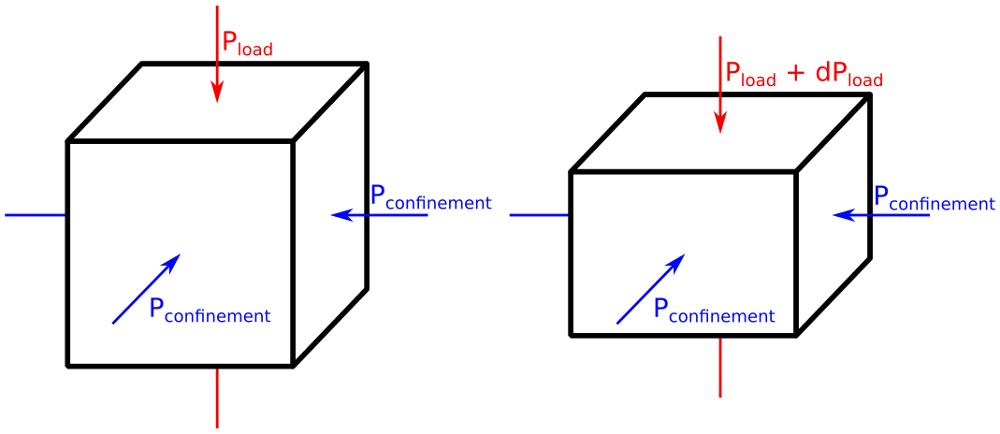

# DEM_Cycling_Loading
A cemented granular material is under triaxial and isotropic cyclic loading.
The goal is to model the experiments detailed in [1].
The DEM software employed is [https://yade-dem.org/doc/](YADE).

[1] Z. Xu, J. Sulem, & P. Braun (2026) Porosity‐permeability evolution of carbonate rocks under cyclic hydrostatic loading: Creep‐fatigue interaction and implications for hydrogen storage. Journal of Geophysical Research: Solid Earth 131:e2025JB033646. https://doi.org/10.1029/2025JB033646

## Isotropic conditions

## Triaxial conditions

